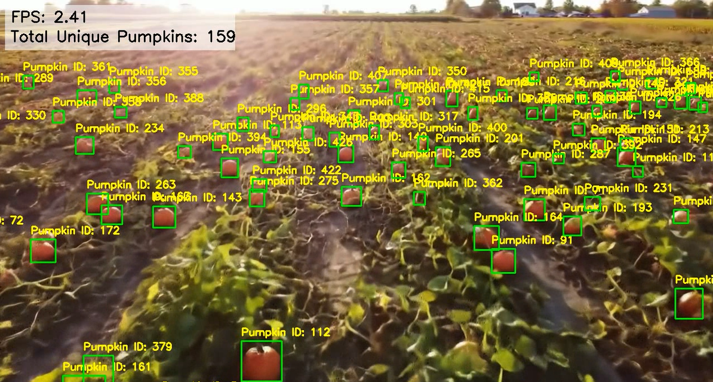

# 🎃 Pumpkin Detection, Tracking & Counting with YOLOv12 + Deep SORT

This project uses **YOLOv8** for real-time pumpkin detection and **Deep SORT** for object tracking to assign **unique IDs** to each pumpkin and track them across frames in a video of a pumpkin field.

## 🧰 Requirements

Install dependencies:

```bash
pip install ultralytics opencv-python deep_sort_realtime
```

---

## 📦 Usage

1. Place your **YOLOv8 model** as `pumpkin_yolov8.pt` in the project folder.
2. Place your input **video** as `pumpkin_field_video.mp4`.
3. Run the script:

```bash
python pumpkin_deepsort_optimized.py
```

4. Output will be saved as `output_pumpkin_deepsort_optimized.mp4`.

---

## 🎯 Demo Output

- **Bounding Boxes**: Accurately highlight each detected pumpkin.
- **Pumpkin ID**: Consistently labeled across frames.
- **Overlay**: Displays FPS and number of unique pumpkins detected.
  


---

## 🛠 Customization

| Feature               | Location / Variable             | Notes |
|----------------------|----------------------------------|-------|
| Model path           | `YOLO_MODEL_PATH`                | Replace with your custom YOLOv8 `.pt` file |
| Input video path     | `VIDEO_SOURCE`                   | Can also use `0` for webcam |
| Detection threshold  | `CONFIDENCE_THRESHOLD`           | Filter out low-confidence predictions |
| Tracker lifespan     | `DeepSort(max_age=30)`           | Controls how long IDs persist |

---

## 📌 Notes

- This project assumes you’ve trained a YOLOv8 model on pumpkins.
- It works best on well-lit, high-resolution field videos.
- Frame skipping or resizing can boost FPS for slower systems.

---

## 📄 License

This project is under the MIT License. See [LICENSE](LICENSE) for details.

---

## ✨ Credits

- [Ultralytics YOLOv12](https://github.com/ultralytics/ultralytics)
- [Deep SORT Realtime](https://github.com/levan92/deep_sort_realtime)
